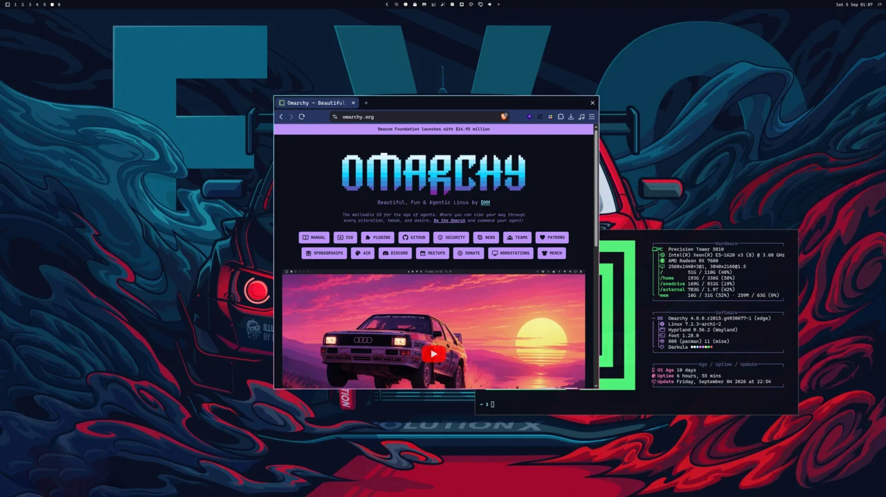
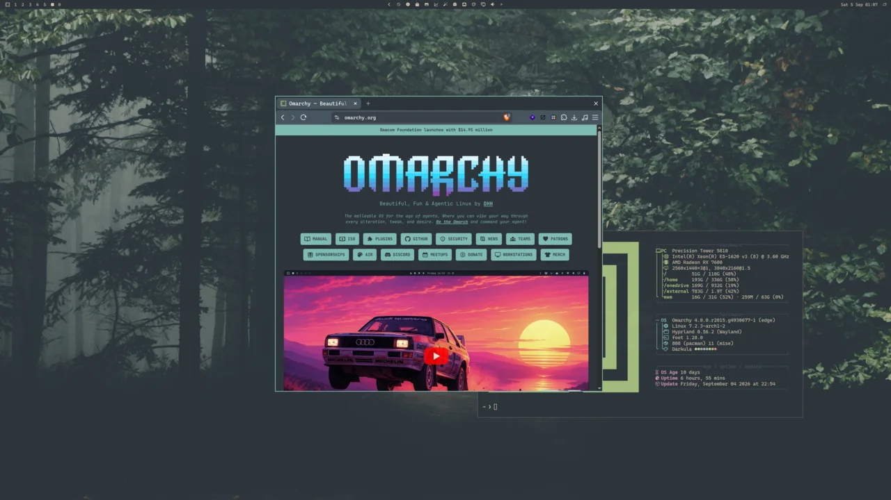

<p>
  <a href="docs/omarchy-org-moon-full.webp"></a>
  <a href="docs/omarchy-org-evo-full.webp"></a>
  <a href="docs/omarchy-org-forest-full.webp"></a>
</p>

# Webtheme

Style any website to match your Omarchy theme. Websites switch colour scheme along with the Omarchy theme.

Install the plugin and restart the browser to pick the extension. 

The plugin ships a small unpacked MV3 extension and appends it to the existing `--load-extension=` line in Chromium/Brave flags (the same mechanism Omarchy uses for WhatsApp Slim).

## Install

```bash
omarchy plugin add https://github.com/sebday/omarchy-webtheme.git --enable
```

## Requirements

- `bash` and `jq` (both ship with Omarchy)
- Brave and/or Chromium using `~/.config/brave-flags.conf` / `~/.config/chromium-flags.conf`

## New sites

Use the button in the extension or ask your agent to theme a site. 

Bundled packages live in `sites/<id>/` in this repo. Your own packages (and overrides) go in `~/.config/omarchy/webtheme/sites/<id>/` so plugin updates do not clobber them.

```
sites/github/
  site.json
  style.css
```

```json
{
  "id": "github",
  "name": "GitHub",
  "matches": ["https://github.com/*"],
  "enabled": true
}
```


Drop a new folder into `~/.config/omarchy/webtheme/sites/` and run:

```bash
~/.config/omarchy/plugins/evo.webtheme/bin/webtheme assemble
```

## CLI

```bash
webtheme setup          # assemble + flags + theme-set hook (runs on plugin enable)
webtheme assemble       # rebuild runtime extension
webtheme list           # JSON {enabled, sites}
webtheme enabled [true|false]
webtheme save           # write a user site package from JSON on stdin
webtheme theme-site [--launch] <url> [title]
```

## License

MIT.
