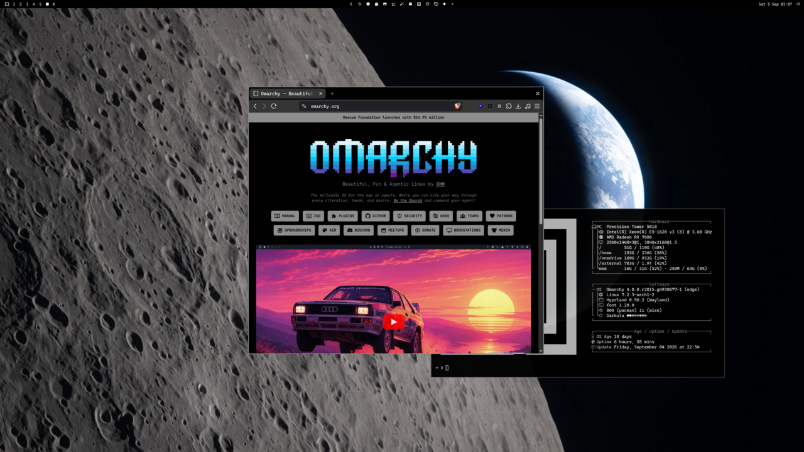

<p>
  
  
  
</p>

# Webtheme

Omarchy theme CSS for Brave and Chromium. Install the plugin, restart the browsers once, and matching sites pick up the current Omarchy palette. 

The plugin ships a small unpacked MV3 extension and appends it to the existing `--load-extension=` line in Chromium/Brave flags (same mechanism Omarchy uses for WhatsApp Slim).

## Install

```bash
omarchy plugin add https://github.com/sebday/omarchy-webtheme.git --enable
```

## Requirements

- `bash` and `jq` (both ship with Omarchy)
- Brave and/or Chromium using `~/.config/brave-flags.conf` / `~/.config/chromium-flags.conf`

## Site packages

Bundled packages live in `sites/<id>/` in this repo. Your own packages (and overrides) go in `~/.config/omarchy/webtheme/sites/<id>/` so plugin updates do not clobber them.

```
sites/github/
  site.json
  style.css
```

```json
{
  "id": "github",
  "name": "GitHub",
  "matches": ["https://github.com/*"],
  "enabled": true
}
```

`style.css` should use the Omarchy web variables from the active theme (`--bg-primary`, `--bg-secondary`, `--text-primary`, `--text-accent`, and the colour tokens). Those come from `colors.css`, generated from `themed/colors.css.tpl` on every `omarchy theme set`. Plugin setup links that template (and `shoelace-hex.css.tpl`) into `~/.config/omarchy/themed/`.

Shoelace docs (`shoelace.style`) use the generated `shoelace-hex.css` from the theme instead of a static `style.css`. Other Shoelace apps belong in your user store with the same `themeCss`.

Drop a new folder into `~/.config/omarchy/webtheme/sites/` and run:

```bash
~/.config/omarchy/plugins/evo.webtheme/bin/webtheme assemble
```

The toolbar popup shows the enabled count, a pause switch, and **Theme this site** for an unthemed tab. Package toggles live on the **All sites** page. **Theme this site** sends `THEMEGEN.md` to the Omarchy default agent in the background and shows a desktop toast plus an extension notification. The bar panel only shows counts.

## CLI

```bash
webtheme setup          # assemble + flags + theme-set hook (runs on plugin enable)
webtheme assemble       # rebuild runtime extension
webtheme list           # JSON {enabled, sites}
webtheme enabled [true|false]
webtheme save           # write a user site package from JSON on stdin
webtheme theme-site [--launch] <url> [title]
```

## License

MIT.
